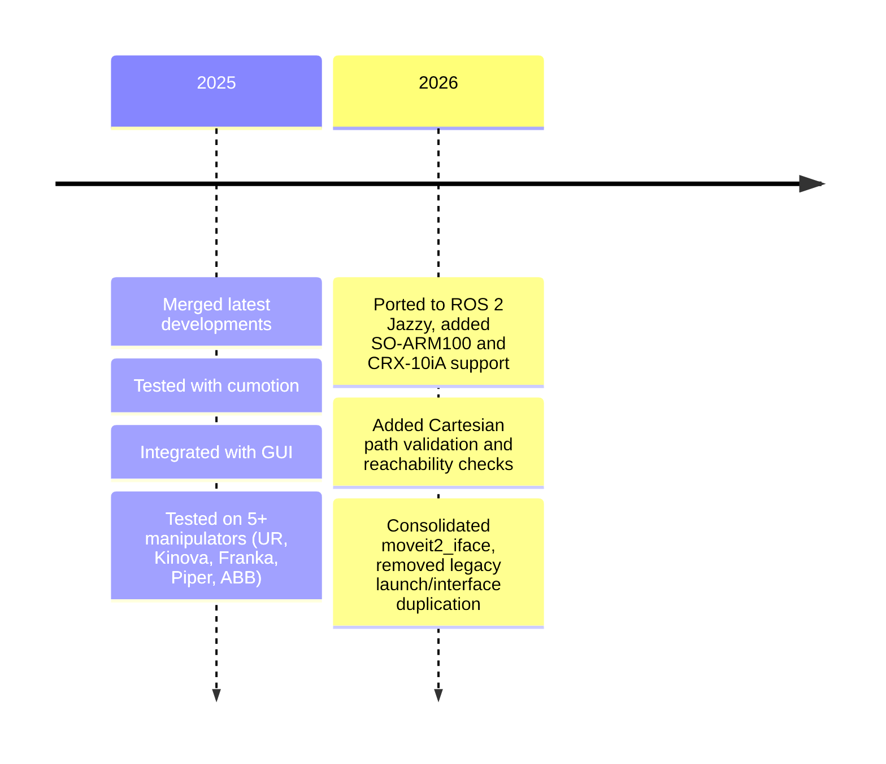

# arm_api2

:mechanical_arm: API for robotic manipulators based on ROS 2 and MoveIt2!

Docker for building required environment can be found [here](https://github.com/CroboticSolutions/docker_files/tree/master/ros2/humble/arm_api2).

### Use prebuilt docker

Pull and run docker container `arm_api2_cont`:
```
git clone git@github.com:CroboticSolutions/docker_files.git
cd ./docker_files/ros2/humble/arm_api2
./pull_and_run_docker.sh
<robot>_sim (start robot in simulation)
```
Run move_group for that robot (see particular instructions for supported arms in How to use section).
And after that run:
```
ros2 launch arm_api2 moveit2_iface.launch.py robot_name:=<robot_name>
```
Currently available robot config names include: `ur`, `kinova`, `franka`, `piper`, `abb`, `crx10ia`, and `so_arm100`.

For full instructions check section How to use arm_api2?

### Build your own docker

In order to build it easily, run following commands:
```
git clone git@github.com:CroboticSolutions/docker_files.git
cd ./docker_files/ros2/humble/arm_api2
docker build -t arm_api2_img:humble .
./run_docker.sh
```

After running docker, you can enter container with:
```
docker exec -it arm_api2_cont bash
```

Docker for building required environment can be found [here](https://github.com/CroboticSolutions/docker_files/tree/master/ros2/humble/kinova).

For building ROS 2 packages and MoveIt, it is necessary to use [colcon](https://colcon.readthedocs.io/en/released/user/quick-start.html).

## Tell us anonymously what arms we should support [here](https://forms.gle/d1fdfAbwZunDUcSi9). :smile:

### Depends on:

- [arm_api2_msgs](https://github.com/CroboticSolutions/arm_api2_msgs)

Additional dependencies are (depending on the arm you use):

- [kinova](https://github.com/CroboticSolutions/ros2_kortex)
- [panda_sim](https://github.com/AndrejOrsula/panda_ign_moveit2)
- [ur](https://github.com/UniversalRobots/Universal_Robots_ROS2_Driver)
- [ur_sim](https://github.com/CroboticSolutions/Universal_Robots_ROS2_GZ_Simulation)
- abb, crx10ia, piper and so_arm100 each ship their own MoveIt config under `config/<robot_name>/`; see the respective `_moveit_config`/driver package for that arm

### How to use arm_api2?

**Change robot state**:

The robot state can be changed via a ROS2 service.

- name: `arm/change_state`
- srv: `/arm_api2_msgs/srv/ChangeState.srv`
- values `JOINT_TRAJ_CTL || CART_TRAJ_CTL || SERVO_CTL`

Example service call:

```bash
ros2 service call /arm/change_state arm_api2_msgs/srv/ChangeState "{state: JOINT_TRAJ_CTL}"
```

Currently implemented and available robot states are:

- `JOINT_TRAJ_CTL`, which is used for joint control
- `CART_TRAJ_CTL`, which is used for cartesian control
- `SERVO_CTL`, which is used for the end effector servoing

**Set max velocity and acceleration scaling factor**:

Set velocity and acceleration scaling factors via service call:

- name: `arm/set_vel_acc`
- srv: `/arm_api2_msgs/srv/SetVelAcc.srv`
- values `max_vel` and `max_acc` (both float64)

Example service call:

```bash
ros2 service call /arm/set_vel_acc arm_api2_msgs/srv/SetVelAcc "{max_vel: 0.5, max_acc: 0.5}"
```

**Set end effector link**:

Set end effector link via service call:

- name: `arm/set_eelink`
- srv: `/arm_api2_msgs/srv/SetStringParam.srv`
- values `value` (string)

Example service call:

```bash
ros2 service call /arm/set_eelink arm_api2_msgs/srv/SetStringParam "{value: 'tcp'}"
```

**Set planonly mode**:

Planonly mode is used to plan a trajectory without executing it.
Set planonly mode via service call:
- name: `arm/set_planonly`
- srv: `/std_srvs/srv/SetBool.srv`
- values `value` (bool)

Example service call:

```bash
ros2 service call /arm/set_planonly std_srvs/srv/SetBool "{data: true}"
```

### Unified interface

`moveit2_iface` is the single arm_api2 node. It always exposes the topic-based
interface; the `mode` argument selects the interface profile:

```bash
# simple: topic interface only
ros2 launch arm_api2 moveit2_iface.launch.py robot_name:=<robot> mode:=simple

# advanced (default): topic interface + action servers
ros2 launch arm_api2 moveit2_iface.launch.py robot_name:=<robot> mode:=advanced
```

Fine-grained overrides are still available with `enable_topics:=<true|false>` and
`enable_actions:=<true|false>`; when left empty they are derived from `mode`.

Multi-robot setups pass semicolon-separated namespaces; one arm_api2 instance is
spawned per namespace:

```bash
ros2 launch arm_api2 moveit2_iface.launch.py robot_name:=ur robot_namespaces:=ur1\;ur2
```

**All launch arguments** (`launch/moveit2_iface.launch.py`):

| Argument | Default | Description |
| --- | --- | --- |
| `robot_name` | `kinova` | Robot config to load (see supported names above) |
| `robot_ns` | `""` | ROS namespace for a single arm_api2 instance (e.g. `ur1`). Empty keeps the root namespace |
| `robot_namespaces` | `""` | Semicolon-separated namespaces for multi-robot setups; overrides `robot_ns` |
| `mode` | `advanced` | `simple` exposes just the topic interface, `advanced` adds the action servers |
| `enable_topics` | `""` | Override topic interface on/off; empty derives it from `mode` |
| `enable_actions` | `""` | Override action interface on/off; empty derives it from `mode` |
| `config_profile` | `sim` | Config profile suffix to load, e.g. `sim` or `real` (looks for `config/<robot>/<robot>_<profile>.yaml`) |
| `use_sim_time` | `false` | Use simulation time |
| `dt` | `0.01` | Servo control loop time step |
| `launch_joy` | `false` | Also launch the `joy_ctl` joystick control node |
| `launch_servo_watchdog` | `false` | Also launch the `servo_watchdog.py` node |
| `use_gdb` | `false` | Run `moveit2_iface` under `gdb` in an xterm window, for debugging |

### Additional nodes

Besides `moveit2_iface`, the package builds/installs these executables:

- **`joy_ctl`** (`src/arm_joy_node.cpp`, `src/arm_joy.cpp`) — joystick teleoperation node, converts `sensor_msgs/msg/Joy` input into servo twist/joint commands. Launch it standalone or together with `moveit2_iface` via `launch_joy:=true`.
- **`keyboard_ctl`** (`src/servo_keyboard_input.cpp`) — keyboard teleoperation node for servo mode.
- **`servo_watchdog.py`** (`examples/scripts/servo_watchdog.py`) — monitors twist/jog commands and publishes zero velocity if no command is received for a few seconds; enable with `launch_servo_watchdog:=true`.

### Example scripts

`examples/scripts/` contains standalone Python clients that can be run against a live `moveit2_iface` node, useful as a reference for writing your own client:

| Script | Purpose |
| --- | --- |
| `pose_sender_action_client.py` / `_async.py` | Send a Cartesian pose goal via the `arm/move_to_pose` action (blocking / async) |
| `joint_sender_action_client.py` / `_async.py` | Send a joint-position goal via the `arm/move_to_joint` action (blocking / async) |
| `trajectory_sender_action_client.py` / `_async.py` | Send a Cartesian path goal via the `arm/move_to_pose_path` action (blocking / async) |
| `servo_twist_sender.py` | Publish example Cartesian twist commands for servo mode |
| `servo_watchdog.py` | Same node as installed under `launch_servo_watchdog`; can also be run standalone |

### Topic interface

Run minimal simple interface with:
```
ros2 launch arm_api2 moveit2_iface.launch.py robot_name:=<robot> mode:=simple
```

Simple interface contains topics to command robot pose, path and
retrieve arm information.
Topic names are defined in the `config/<robot_name>/<robot_name>_<config_profile>.yaml` file.


**Command robot pose**:
- name: `arm/cmd/pose`
- msg: `geometry_msgs/msg/PoseStamped.msg`

```
ros2 topic pub /arm/cmd/pose geometry_msgs/msg/PoseStamped <wanted_pose>
```

**Command cartesian path**:
- name: `arm/cmd/traj`
- msg: `arm_api2_msgs/msg/CartesianWaypoints.msg`

**Get current end effector pose**:
- name `arm/state/current_pose`
- msg: `geometry_msgs/msg/PoseStamped.msg`

```
ros2 topic echo /arm/state/current_pose
```

**Other state topics** (published by the node, names configurable per robot in `config/<robot_name>/`):

| Topic | Msg type | Description |
| --- | --- | --- |
| `arm/state/ctl_state` | `std_msgs/msg/String` | Currently active control state (`JOINT_TRAJ_CTL`, `CART_TRAJ_CTL`, `SERVO_CTL`) |
| `arm/state/gripper_state` | `std_msgs/msg/String` | Current gripper state, published on gripper actuation |
| `arm/state/plan_status` | `arm_api2_msgs/msg/PlanStatus` | Result/status of the last planning attempt (transient-local, latched) |

### Service interface (additional)

Beyond `arm/change_state`, `arm/set_vel_acc`, `arm/set_eelink` and `arm/set_planonly` documented above:

**Set motion planner**:
- name: `arm/set_planner`
- srv: `arm_api2_msgs/srv/SetStringParam.srv`
- values `value` (string), format `"<pipeline>_<planner_id>"`, e.g. `pilz_LIN`, `ompl_EST`, `ompl_PRM`, or `cumotion` (tried first, with automatic fallback to LIN/EST/PRM if it fails)

```bash
ros2 service call /arm/set_planner arm_api2_msgs/srv/SetStringParam "{value: 'ompl_EST'}"
```

**Open / close gripper**:
- names: `arm/open_gripper`, `arm/close_gripper`
- srv: `std_srvs/srv/Trigger.srv`

```bash
ros2 service call /arm/open_gripper std_srvs/srv/Trigger
```

**Check reachability / Cartesian path feasibility**:
- names: `arm/check_reachability`, `arm/check_cartesian_path`
- srv: `arm_api2_msgs/srv/CheckReachability.srv`, `arm_api2_msgs/srv/CheckCartesianPath.srv`

Both let you validate a target pose or waypoint list before committing to a move, without executing it.

### Action interface

Run the unified node with actions enabled:
```
ros2 launch arm_api2 moveit2_iface.launch.py robot_name=<robot>
```

**Command robot pose**:

A robot pose where the robot should move to can be commanded via ROS2 action.
- name: `arm/move_to_pose`
- action: `arm_api2_msgs/action/MoveCartesian.action`

```
ros2 action send_goal /arm/move_to_pose arm_api2_msgs/action/MoveCartesian <wanted_pose>
```

**Command cartesian path**:

A Cartesian path can be commanded via ROS2 action.
- name: `arm/move_to_pose_path`
- action: `arm_api2_msgs/action/MoveCartesianPath.action`

**Command joint position**:

A robot joint position where the robot should move to can be commanded via ROS2 action.
- name: `arm/move_to_joint`
- action: `arm_api2_msgs/action/MoveJoint.action`

**Command gripper**:

The gripper can be commanded via a standard ROS2 `GripperCommand` action.
- name: `arm/gripper_control`
- action: `control_msgs/action/GripperCommand.action`


<summary><h3>How to build package?</h3></summary>

### Build

Build in ROS 2 workspace.
Build just one package with:

```bash
colcon build --packages-select arm_api2
```

Build with the compile commands (enable autocomplete):

```bash
colcon build --symlink-install --cmake-args -DCMAKE_EXPORT_COMPILE_COMMANDS=ON
```

Building with `--symlink-install` causes it to fail often because of already built ROS 2 packages, you can run:

```
colcon build --symlink-install --cmake-args -DCMAKE_EXPORT_COMPILE_COMMANDS=ON --continue-on-error
```

Full verbose build command:

```
colcon build --symlink-install --packages-select arm_api2 --cmake-args -DCMAKE_EXPORT_COMPILE_COMMANDS=ON -DCMAKE_VERBOSE_MAKEFILE=ON
```

</details>

### Simplify your life

#### Aliases

Copy to `~/.bashrc` and source it.

```bash
alias cbp="colcon build --symlink-install --packages-select"
alias panda_sim="ros2 launch panda gz.launch.py"
alias kinova_sim="ros2 launch kortex_bringup kortex_sim_control.launch.py dof:=7 use_sim_time:=true launch_rviz:=false"
alias ur_sim="ros2 launch ur_simulation_gz ur_sim_control.launch.py ur_type:=\"ur10\""
```

Build `arm_api2` package as:

```bash
cbp arm_api2
```

Start franka sim with:

```bash
franka_sim
```

Start kinova sim with:

```bash
kinova_sim
```

Start ur sim with:

```bash
ur_sim
```

Start iface by changing the `robot_name` argument to the arm config you want to use, for example `kinova`, `ur`, `franka`, or `piper`:

```bash
ros2 launch arm_api2 moveit2_iface.launch.py robot_name:=<robot_name>
```

#### Tmuxinator

Start kinova with:

```bash
tmuxinator start kinova_api2
```

after calling

```bash
./copy_tmuxinator_config.sh kinova_api2.yml
```

located in `utils/tmux_configs`. Navigate between
panes with `Ctrl+B`+(arrows).

<details>
<summary><h3>How to use Kinova? </summary>

First clone and build kinova repository in your workspace with:
```
cd <ros2_ws>/src
git clone https://github.com/CroboticSolutions/ros2_kortex
cd <ros2_ws>
colcon build --packages-select ros2_kortex
source <ros2_ws>/install/setup.bash
```

You can run kinova in simulation by executing following commands:

```bash
ros2 launch kortex_bringup kortex_sim_control.launch.py dof:=7 use_sim_time:=true launch_rviz:=false
```

or

```bash
kinova_sim
```

if alias has been added.

After that run `move_group` node as follows:

```bash
ros2 launch kinova_gen3_7dof_robotiq_2f_85_moveit_config sim.launch.py
```

After that run `arm_api2` `moveit2_iface` node as follows:

```bash
ros2 launch arm_api2 moveit2_iface.launch.py robot_name:="kinova"
```

#### Kinova

How to setup real kinova [here](https://git.initrobots.ca/amercader/kinova-kortex-installation).

</details>

<details>
<summary><h3>How to use UR?</summary>

You can run UR in simulation by executing following commands:

```
ros2 launch ur_simulation_gz ur_sim_control.launch.py ur_type:="ur10"
```

or

```
ur_sim
```

if alias has been added.

After that run `move_group` node as follows:

```
ros2 launch ur_moveit_config ur_moveit.launch.py ur_type:="ur10" use_sim_time:=true
```

After that run `arm_api2` `moveit2_iface` node as follows:

```
ros2 launch arm_api2 moveit2_iface.launch.py robot_name:="ur"
```

#### How to setup?

First run:

```
sudo apt-get install ros-humble-ur
```

After that, in your ROS 2 workspace clone:

- [ur_gz_sim](https://github.com/CroboticSolutions/Universal_Robots_ROS2_GZ_Simulation/tree/humble)
- [ur_ros2_driver](https://github.com/CroboticSolutions/Universal_Robots_ROS2_Driver/tree/humble)
  and build your workspace. Source it, and you're good to go.

Note, those are forks of the official UR repositories on the `humble` branch,
with [slight changes](https://github.com/CroboticSolutions/Universal_Robots_ROS2_Driver/commit/3ad47d7afaf99eeb1f69c6bb23bbdcccce12c4f5) to the `launch` files.

</details>

<details>
<summary><h3>How to use with custom arm?</summary>

In order to use this package with custom arm, you need to do following:

1.  Create moveit_package for your arm using `moveit_setup_assistant`.
    Tutorial on how to use it can be be found [here](https://moveit.picknik.ai/main/doc/examples/setup_assistant/setup_assistant_tutorial.html).
    Output of the `moveit_setup_assistant` is `<custom_arm>_moveit_config` package.

2.  Create config files:

a) Create `<custom_arm>_config.yaml` and `<custom_arm>_servo_config.yaml` in the config folder.
b) Modify `moveit2_iface.launch.py` script by setting correct `robot` argument to the `<custom_arm>` value.

3. Setup robot launch file:

In order to be able to use `<custom_arm>` please make sure that you set following parameters to true when launching
`moveit_group` node (generated by moveit_setup_assistant):

```
    publish_robot_description_semantic = {"publish_robot_description_semantic": True}
    publish_robot_description = {"publish_robot_description": True}
    publish_robot_description_kinematics = {"publish_robot_description_kinematics": True}

```

as shown [here](https://github.com/CroboticSolutions/ros2_kortex/blob/main/kortex_moveit_config/kinova_gen3_7dof_robotiq_2f_85_moveit_config/launch/sim.launch.py).

4. Launch:

a) Launch your robot (see examples on kinova, UR or Franka) - `move_group` node
b) Launch `moveit2_iface.launch.py` with correct `robot` param.

</details>

<details>
<summary><h3> Arm interfaces </h3></summary>

- [franka_ros2](https://support.franka.de/docs/franka_ros2.html)
- [kinova_ros2](https://github.com/Kinovarobotics/ros2_kortex)
- [UR_ros2](https://github.com/UniversalRobots/Universal_Robots_ROS2_Driver)
</details>

<details>
<summary><h3> Useful learning links</h3></summary>

- [Declare variables as const](https://www.cppstories.com/2016/12/please-declare-your-variables-as-const/)
- [Complicated variable initialization](https://www.cppstories.com/2016/11/iife-for-complex-initialization/)
- [C++ good practices](https://ctu-mrs.github.io/docs/introduction/c_to_cpp.html)
- [MoveIt2! C++ iface](https://moveit.picknik.ai/main/doc/examples/move_group_interface/move_group_interface_tutorial.html)
- [How to setup VSCode](https://picknik.ai/vscode/docker/ros2/2024/01/23/ROS2-and-VSCode.html)
- [First Cpp node for ROS 2](https://turtlebot.github.io/turtlebot4-user-manual/tutorials/first_node_cpp.html)
- [Composition of ROS nodes](https://answers.ros.org/question/316870/ros2-composition-and-node-names-with-launch-files/)
- [planning_scene](https://github.com/moveit/moveit2_tutorials/blob/main/doc/examples/planning_scene/src/planning_scene_tutorial.cpp)
- [custom moveit ns](https://github.com/moveit/moveit2/issues/2415)
- [publish robot_description](https://github.com/moveit/moveit2_tutorials/issues/525)
- [joint state clock not in sync](https://answers.ros.org/question/417209/how-to-extract-position-of-the-gripper-in-ros2moveit2/)
- [issue for initializing MGI](https://github.com/moveit/moveit2/issues/496)

</details>

<details>
<summary><h3>Status</h3></summary>

### TODO [High priority]:

- [x] Fix command/reached pose mismatch!
- [x] Add orientation normalization
- [x] Add contributing
- [x] Add gripper abstract class
- [ ] Add correct inheritance for the gripper abstract class
- [x] Create universal launch file
- [x] Create standardized joystick class
- [x] Test on the real robot
- [x] Test on the real UR
- [ ] Test on the real Franka
- [ ] Test on the real Kinova
- [ ] Test on the real FANUC

### TODO [Low priority]:

- [x] Test with real robot manipulator [tested on Kinova, basic functionality tested]
- [x] Add basic documentation
- [x] Add roadmap
- [ ] Discuss potential SW patterns that can be used
- [x] Add full cartesian following
- [ ] Add roll, pitch, yaw and quaternion conversion
- [x] Decouple moveit2_iface.cpp and utils.cpp (contains all utils scripts)
- [x] Create table of supported robot manipulators
</details>

<details>

<summary><h3>Supported arms table<h3></summary>

|     Arms     | CART_TRAJ_CTL | JOINT_TRAJ_CTL | SERVO_CTL | SIM | REAL | EXT_TEST |
| :----------: | ------------- | -------------- | --------- | --- | ---- | -------- |
| Franka Emika | +             | +              | +         | +   | -    | -        |
| Kinova       | +             | +              | +         | +   | -    | -        |
| UR           | +             | +              | +         | +   | +    | -        |
| ABB          | +             | +              | +         | +   | -    | -        |
| CRX-10iA     | +             | +              | +         | +   | +    | -        |
| SO-ARM100    | +             | +              | +         | +   | -    | -        |
| Piper        | +             | +              | +         | +   | +    | -        |

</details>


<summary><h3>moveit status codes</h3></summary>

<details>

MoveIt2! status codes that can be used to debug moveit servo:

```
INVALID = -1,
NO_WARNING = 0,
DECELERATE_FOR_APPROACHING_SINGULARITY = 1,
HALT_FOR_SINGULARITY = 2,
DECELERATE_FOR_COLLISION = 3,
HALT_FOR_COLLISION = 4,
JOINT_BOUND = 5,
DECELERATE_FOR_LEAVING_SINGULARITY = 6
```

</details>

## Roadmap



If you want to contribute, please check **Status** section and check [CONTRIBUTING](./CONTRIBUTING.md).
