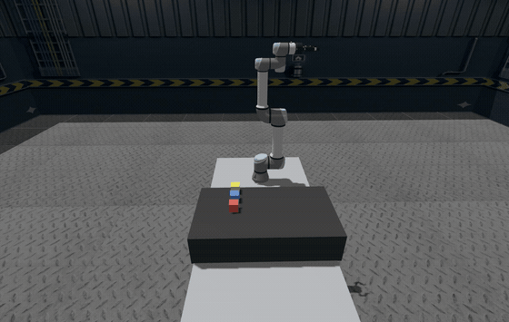

# Pick and place with **arm_api2**

This tutorial walks through a minimal **pick-and-place** sequence on a simulated Universal Robots arm using **arm_api2**. The same pattern applies to other supported manipulators: a small set of **topics** and **services** replaces bespoke MoveIt client code, so application logic stays short and maintainable.

<p align="center">
  
</p>

**Why arm_api2 for pick and place**

| Without a unified API | With arm_api2 |
|----------------------|---------------|
| Wire MoveIt actions, planners, and frame logic per application | Send **pose commands** on `/arm/cmd/pose` and switch control mode with **one service** |
| Reimplement joint vs Cartesian flows | Toggle `JOINT_TRAJ_CTL` vs `CART_TRAJ_CTL` when you need axis-aligned descent |
| Ad-hoc gripper integration | Call **`/arm/open_gripper`** and **`/arm/close_gripper`** (service types as in your config) |

You focus on **waypoints** (home, approach, pick, place, retract) - not on low-level ROS or MoveIt wiring.

For a **scripted multi-step** pick-and-place, skip straight to **section 4** below (YAML + one `ros2 run`); section 3 is there to show the underlying commands step by step.

---

## Prerequisites

- **Docker (optional, Jazzy):** use the repo **`Dockerfile`** and **`first-run.sh`** (image `arm_api2:tutorial`, container `arm_api2_tutorial`; host network, X11, SSH agent — see the script):

  ```bash
  git clone git@github.com:CroboticSolutions/docker_files.git
  cd ./docker_files/ros2/jazzy/arm_api2_tutorial
  docker build -t arm_api2:tutorial .
  chmod +x first-run.sh
  ./first-run.sh
  ```

  Inside the container, continue with **section 1** (Gazebo + MoveIt), then **section 2** (`arm_api2`).

- **Or** a ROS 2 workspace with `arm_api2`, `ur_simulation_gz`, and `ur_moveit_config` built and sourced on the host.
- This example uses namespace **`ur1`** and planning frame **`world`**, matching `robots_profile:=lab_gripper_one` (UR + Robotiq + `lab_table_one` world with three cubes).

---

## 1. Start simulation and MoveIt

Terminal 1 - Gazebo + MoveIt + configured world (red / blue / yellow cubes):

```bash
ros2 launch ur_simulation_gz multi_ur_sim_moveit.launch.py robots_profile:=lab_gripper_one
```

Wait until MoveIt and controllers are up before continuing.

---

## 2. Start arm_api2 (simple mode)

Terminal 2:

```bash
ros2 launch arm_api2 moveit2_iface.launch.py mode:=simple \
  robot_name:=ur robot_ns:=ur1 use_sim_time:=true
```

All commands below use the **`/ur1`** prefix. Adjust if your namespace differs.

---

## 3. Pick-and-place sequence (conceptual steps)

1. **Home** - Move the arm to a safe starting pose (joint-space motion).
2. **Approach** - Move above the first cube (same orientation, higher *z*).
3. **Pick** - Switch to Cartesian control; descend along *z*; close the gripper.
4. **Retract** - Lift clear of the table.
5. **Move to place** - Joint motion to approach above the drop pose.
6. **Place** - Cartesian descent; open the gripper; retract.

The numbered commands below implement that flow. Numeric poses are **example** values for the bundled world; tune for your calibration.

---

### 3.1 Move to home (`JOINT_TRAJ_CTL`)

Put the arm in joint trajectory mode, then send a single pose target (joint-space planning behind the scenes):

```bash
ros2 service call /ur1/arm/change_state arm_api2_msgs/srv/ChangeState "{state: 'JOINT_TRAJ_CTL'}"
```

```bash
ros2 topic pub --once /ur1/arm/cmd/pose geometry_msgs/msg/PoseStamped \
"{header: {frame_id: 'world'}, pose: {position: {x: 0.08571, y: 0.2951, z: 1.664}, orientation: {x: 1.0, y: 0.0, z: 0.0, w: 0.0}}}"
```

---

### 3.2 Approach above the first cube

```bash
ros2 topic pub --once /ur1/arm/cmd/pose geometry_msgs/msg/PoseStamped \
"{header: {frame_id: 'world'}, pose: {position: {x: 0.3988, y: 0.5512, z: 1.54}, orientation: {x: 1.0, y: 0.0, z: 0.0, w: 0.0}}}"
```

---

### 3.3 Pick - Cartesian descent and grasp

Switch to Cartesian trajectory control for straight-line motion (here, along *z*):

```bash
ros2 service call /ur1/arm/change_state arm_api2_msgs/srv/ChangeState "{state: 'CART_TRAJ_CTL'}"
```

```bash
ros2 topic pub --once /ur1/arm/cmd/pose geometry_msgs/msg/PoseStamped \
"{header: {frame_id: 'world'}, pose: {position: {x: 0.3988, y: 0.5512, z: 1.4767}, orientation: {x: 1.0, y: 0.0, z: 0.0, w: 0.0}}}"
```

Close the gripper:

```bash
ros2 service call /ur1/arm/close_gripper std_srvs/srv/Trigger {}
```

---

### 3.4 Retract (lift)

```bash
ros2 topic pub --once /ur1/arm/cmd/pose geometry_msgs/msg/PoseStamped \
"{header: {frame_id: 'world'}, pose: {position: {x: 0.3988, y: 0.5512, z: 1.54}, orientation: {x: 1.0, y: 0.0, z: 0.0, w: 0.0}}}"
```

---

### 3.5 Move to place - approach above drop location

Return to joint mode for the horizontal move to the place station:

```bash
ros2 service call /ur1/arm/change_state arm_api2_msgs/srv/ChangeState "{state: 'JOINT_TRAJ_CTL'}"
```

```bash
ros2 topic pub --once /ur1/arm/cmd/pose geometry_msgs/msg/PoseStamped \
"{header: {frame_id: 'world'}, pose: {position: {x: 0.04671, y: 0.5512, z: 1.54}, orientation: {x: 1.0, y: 0.0, z: 0.0, w: 0.0}}}"
```

---

### 3.6 Place - descend and release

```bash
ros2 service call /ur1/arm/change_state arm_api2_msgs/srv/ChangeState "{state: 'CART_TRAJ_CTL'}"
```

```bash
ros2 topic pub --once /ur1/arm/cmd/pose geometry_msgs/msg/PoseStamped \
"{header: {frame_id: 'world'}, pose: {position: {x: 0.04671, y: 0.5512, z: 1.4767}, orientation: {x: 1.0, y: 0.0, z: 0.0, w: 0.0}}}"
```

```bash
ros2 service call /ur1/arm/open_gripper std_srvs/srv/Trigger {}
```

Retract after place:

```bash
ros2 topic pub --once /ur1/arm/cmd/pose geometry_msgs/msg/PoseStamped \
"{header: {frame_id: 'world'}, pose: {position: {x: 0.04671, y: 0.5512, z: 1.54}, orientation: {x: 1.0, y: 0.0, z: 0.0, w: 0.0}}}"
```

---

## 4. Automated pick-and-place (recommended): one Python script + YAML

Sections 3.1–3.6 show the **same** contract (services + `/arm/cmd/pose`) as long shell one-liners. For a real pick-and-place task you rarely want to maintain dozens of those commands by hand.

**With arm_api2, a full multi-step sequence is deliberately small:**

| What you write | What you do *not* write |
|----------------|-------------------------|
| A **YAML** file listing named steps: `change_state`, `pose`, `open_gripper` / `close_gripper` | MoveIt action clients, planners, trajectory monitors, or threading |
| **One** command to run the bundled helper | Timing sleeps, “wait until settled” logic, or ROS graph boilerplate |

The helper script `pick_place_sequence.py` is a thin **rclpy** node: it publishes each target on `/arm/cmd/pose`, calls the same services you would from the CLI, and **waits until** `/ur1/arm/state/current_pose` stays within tolerance before the next step-so the sequence stays in lockstep with the arm without extra code.

**Why this is the fastest path to pick-and-place**

- **Declarative:** You describe *what* (poses and modes), not *how* MoveIt executes internally.
- **One process:** `ros2 run arm_api2 pick_place_sequence.py` - no custom package, no `setup.py`, if the workspace already builds `arm_api2`.
- **Tunable in YAML:** `convergence` (position / angle tolerance, stable samples, timeouts) and `gripper_settle_sec` match your sim or hardware without touching Python.
- **Extensible:** Copy the YAML, duplicate or reorder `steps`, add rows for extra picks; the script does not hard-code the lab world.

**Run it** (with simulation and `moveit2_iface` (simple mode) from sections 1–2):

```bash
ros2 run arm_api2 pick_place_sequence.py
```

Default sequence file (lab table, three cubes, stack-on-place flow):  
`share/arm_api2/tutorials/pick_place_sequence_lab_table_one.yaml`

Use another file as the first argument:

```bash
ros2 run arm_api2 pick_place_sequence.py /path/to/my_sequence.yaml
```

Edit `steps:` in the YAML for your poses; adjust optional `convergence` and `gripper_settle_sec` as needed. That is the entire application surface for a scripted pick-and-place demo on top of arm_api2.

